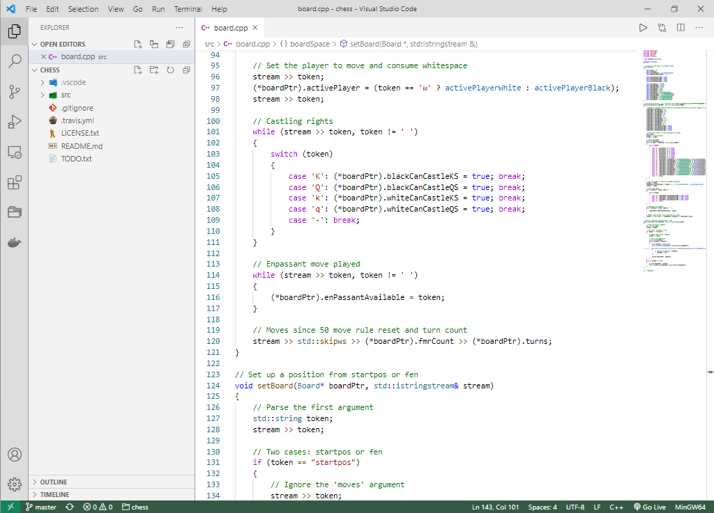

# README
## Description
This is a light theme for VSCode based on Light+. It features a stronger emphasis on the divisions between the activity bar, side bar and editors, and increases the syntax highlighting contrast of variables, functions and types.

